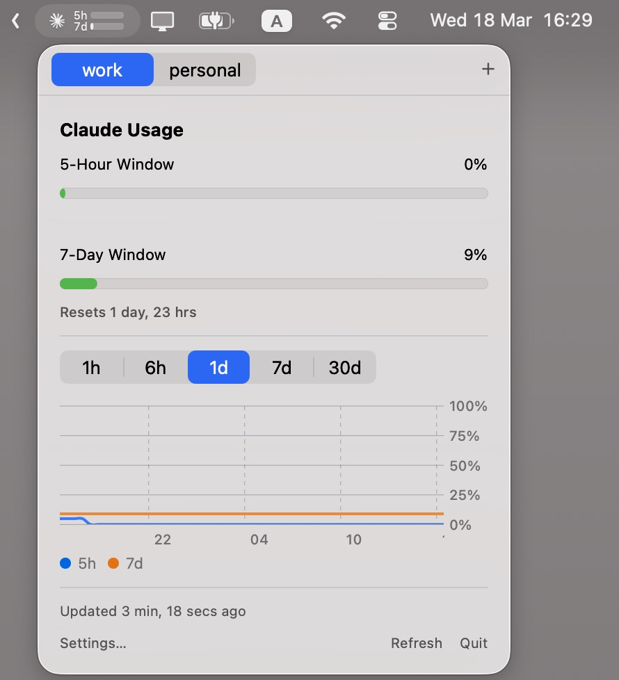

<p align="center">
  
</p>

# Claude Usage Bar

Have you ever found yourself refreshing the Claude usage page, wondering how close you are to hitting your rate limit? Yeah, I've been there too. So I built this.

Now it's just a glimpse away — always sitting at the top of your screen.

<p align="center">
  
</p>


## Fork improvements

This is a fork of [Blimp-Labs/claude-usage-bar](https://github.com/Blimp-Labs/claude-usage-bar) with the following additions and fixes:

**Features**
- **Multi-account support** — add multiple Claude accounts, switch between them via tabs, set optional display aliases. The menu bar icon always reflects the active account. Can be toggled off in Settings when only one account is needed.
- **5-hour usage projection** — projects your current usage trend forward and estimates when you'll run out within the 5-hour window, shown as a small chart alongside the usage history.
- **Claude service-status indicator** — shows Anthropic's status page state (outage/maintenance) in the popover, so you can tell a slowdown from an actual incident. Off by default; enable in Settings.
- **Right-click to quit** — right-click the menu bar icon for a Quit option, without disturbing the normal left-click popover.

**Performance**
- **Near-zero CPU when idle** — the original used `Text(date, style: .relative)` for reset timers and "last updated", which hooks into a display-link and continuously re-renders the view even with the popover closed (~4% constant CPU). Replaced with `RelativeDateTimeFormatter` strings updated by a 60s timer that only runs while the popover is open.
- **Reduced memory footprint** — switched from `URLSession.shared` (which allocates a persistent HTTP cache on disk and in memory) to an ephemeral session. Authenticated API responses are never cacheable anyway. Memory dropped from 350MB to 38MB.

**Bug fixes**
- Token refresh now also triggers on HTTP 429, so the next poll uses a fresh rate-limit window
- Proactive token refresh leeway increased to `pollingInterval + 5 min` to avoid mid-poll expiry
- Menu bar icon now shows the correct account immediately after switching (was reading `activeAccountId` in `willSet` before the property updated)
- Polling interval picker no longer snaps back after changing (extracted as `@ObservedObject` subview so SwiftUI tracks changes correctly)
- Window position preserved on account switch — prevents the popover drifting off-screen in full-screen spaces with auto-hiding menu bar
- `UNUserNotificationCenter` setup deferred to `requestPermission()` — fixes crash in the command-line test runner

## What it does

A tiny macOS menu bar app that shows your Claude API usage at a glance. Click it for the full picture:

- Menu bar icon with a mini dual-bar showing 5-hour and 7-day utilization
- Detailed popover with per-window usage, per-model breakdown, and reset timers
- Extra usage tracking with USD currency display
- Usage history chart — see how your usage evolves over time (1h / 6h / 1d / 7d / 30d)
- Hover over the chart to see exact values at any point
- 5-hour usage projection with a run-out estimate, so you know before you hit the limit
- **Multi-account support** — add multiple Claude accounts, switch between them via tabs, set optional aliases
- Configurable polling interval (5m / 15m / 30m / 1h)
- Optional Claude service-status indicator (off by default — enable in Settings)
- Right-click the menu bar icon to quit
- Built-in update checks via Sparkle
- Just sign in — OAuth via browser, no API keys to manage
- Minimal dependencies — SwiftUI, Swift Charts, Foundation, and Sparkle for updates

## Install

### Download

1. Download `ClaudeUsageBar.dmg` from the [latest release](https://github.com/Blimp-Labs/claude-usage-bar/releases/latest)
2. Open the disk image and drag `ClaudeUsageBar.app` into `Applications`
3. Launch the app from `/Applications`
4. macOS may require right-click → **Open** on first launch

### Build from source

Requires Xcode 15+ / Swift 5.9+ and macOS 14 (Sonoma) or later.

```sh
git clone https://github.com/Blimp-Labs/claude-usage-bar.git
cd claude-usage-bar
make app            # build .app bundle
make dmg            # build drag-to-Applications disk image
make install        # copy to /Applications
```

## Usage

1. Launch the app — a menu bar icon appears
2. Click the icon → **Sign in with Claude** → authorize in your browser
3. Paste the code back into the app
4. The icon updates automatically (default: every 30 minutes)
5. Release builds show **Check for Updates…** in the popover so you can pull newer versions without re-downloading manually

Click the icon anytime to see:
- 5-hour and 7-day usage with progress bars and reset timers
- Per-model breakdown (Opus / Sonnet) when available
- Extra usage credits and limits
- Usage history chart with adjustable time range and hover details

### Multiple accounts

To track more than one Claude account, open **Settings → Accounts** and click **Add Account**. Each account gets its own tab in the popover. You can set a display alias for each account to tell them apart at a glance. The menu bar icon always reflects the active (frontmost) account.

## Security

The app requests two OAuth scopes: `user:profile` (required to read usage and account email) and `user:inference` (part of the standard Claude session grant). Despite the name, `user:inference` does **not** enable making Claude API calls — Anthropic actively rejects OAuth tokens on `POST /v1/messages` with `"OAuth authentication is currently not supported"`. Only API keys work for inference; the token this app holds is read-only in practice.

## Data storage

All data is stored locally in `~/.config/claude-usage-bar/`:

| Location | Purpose |
|----------|---------|
| `accounts.json` | Account list and active account ID |
| Keychain (`claude-usage-bar` service) | OAuth tokens, one entry per account ID |
| `history-{id}.json` | Usage history for each account (30-day retention) |

Existing single-account installs are migrated automatically on first launch: legacy credential files and `history.json` are converted to the new per-account format and an `accounts.json` is created.

History is buffered in memory and flushed to disk immediately after every recorded data point (not on a timer), so it survives reboot, force-quit, or a crash, not just a clean quit. No data is sent anywhere other than the Anthropic API.

## Development

```sh
make build          # release build only
make app            # build + create .app bundle
make zip            # build + bundle + zip + verify distribution artifact
make dmg            # build + bundle + DMG + verify distribution artifact
make release-artifacts  # build once, then create and verify both ZIP and DMG
make verify-release # inspect the packaged ZIP and DMG artifacts
make install        # build + install to /Applications
make clean          # remove build artifacts
```

## Publishing updates

This repo now uses a tag-driven release flow. Pushing a `v*` tag will:

- build the `.app` bundle once
- produce `ClaudeUsageBar.zip` for Sparkle and `ClaudeUsageBar.dmg` for manual installs
- verify the packaged artifacts contain the expected app bundle resources and updater framework
- create the GitHub Release
- reuse GitHub-generated release notes for both the GitHub Release and the Sparkle update entry
- generate a signed Sparkle `appcast.xml` from that exact zip
- deploy the appcast to GitHub Pages

Publishing a release is just:

```sh
git tag v0.0.5
git push origin v0.0.5
```

One-time repo setup:

1. Enable GitHub Pages and set the source to `GitHub Actions`.
2. Add a repository Actions secret named `SPARKLE_PRIVATE_KEY`.

Local source builds intentionally ship with Sparkle disabled unless `SU_FEED_URL` is injected during packaging. This prevents forks and local builds from auto-updating to upstream binaries.

Manual installs should prefer the DMG. The ZIP remains the source of truth for Sparkle updates and appcast generation.

You can export the current Sparkle private key from your local Keychain with:

```sh
macos/.build/artifacts/sparkle/Sparkle/bin/generate_keys --account claude-usage-bar -x /tmp/claude-usage-bar.sparkle.key
gh secret set SPARKLE_PRIVATE_KEY < /tmp/claude-usage-bar.sparkle.key
```

The appcast feed URL used by release builds is:

```text
https://blimp-labs.github.io/claude-usage-bar/appcast.xml
```

### Project structure

```
macos/                           # macOS menu bar app (Swift/SwiftUI)
├── Sources/ClaudeUsageBar/
│   ├── ClaudeUsageBarApp.swift          # App entry point, menu bar setup
│   ├── AccountManager.swift             # Multi-account service locator
│   ├── AccountEntry.swift               # Account model (id, email, alias)
│   ├── UsageService.swift               # OAuth, polling, API calls
│   ├── UsageModel.swift                 # API response types
│   ├── UsageHistoryModel.swift          # History data types, time ranges
│   ├── UsageHistoryService.swift        # Persistence, downsampling
│   ├── UsageChartView.swift             # Swift Charts trajectory view
│   ├── UsageProjection.swift            # 5h usage run-out projection (pure math)
│   ├── ProjectionChartView.swift        # Projection chart rendered in the popover
│   ├── ResetLabelFormatter.swift        # Two-unit "Resets in 3h 50m" countdown formatting
│   ├── PopoverView.swift                # Main popover UI (per-account tabs)
│   ├── SettingsView.swift               # Settings window (accounts, thresholds, service-status toggle)
│   ├── NotificationService.swift        # Usage threshold notifications
│   ├── MenuBarIconRenderer.swift        # Menu bar icon drawing
│   ├── RightClickableMenuBarLabel.swift # Right-click-to-quit on the menu bar icon
│   ├── PollingOptionFormatter.swift     # Polling interval display labels
│   ├── StatusMonitor.swift              # Service-status poller (status.claude.com)
│   ├── StatusPageClient.swift           # HTTP fetch + decode for the statuspage.io summary
│   ├── StatusPageModels.swift           # Wire DTOs for the statuspage.io summary JSON
│   ├── ClaudeServiceStatus.swift        # Service-status domain model + rollup/filter logic
│   ├── ServiceStatusDisplayState.swift  # Maps a status snapshot to what the popover renders
│   ├── AppPaths.swift                   # Shared config directory path
│   ├── AppResources.swift               # Bundle-resource lookups
│   ├── AppUpdater.swift                 # Sparkle update integration
│   ├── StoredCredentials.swift          # Keychain-backed OAuth credential storage
│   └── Resources/
│       ├── claude-logo.png          # Pre-rendered menu bar logo (512px)
│       └── en.lproj/Localizable.strings
├── Tests/ClaudeUsageBarTests/
├── Resources/                       # App bundle resources (not SwiftPM)
│   ├── Info.plist
│   ├── Assets.xcassets/             # App icon
│   └── claude-logo.svg             # Source SVG for menu bar logo
├── scripts/
│   ├── build.sh                     # Build + bundle + codesign
│   └── generate-logo-png.swift      # Regenerate logo PNG from SVG
└── Package.swift

scripts/                         # Shared tooling
└── mock-server.py               # Local mock API for development
```

## Contributing

See [CONTRIBUTING.md](CONTRIBUTING.md) for development setup, testing with the mock server, and submission guidelines.

## License

[BSD 2-Clause](LICENSE)
